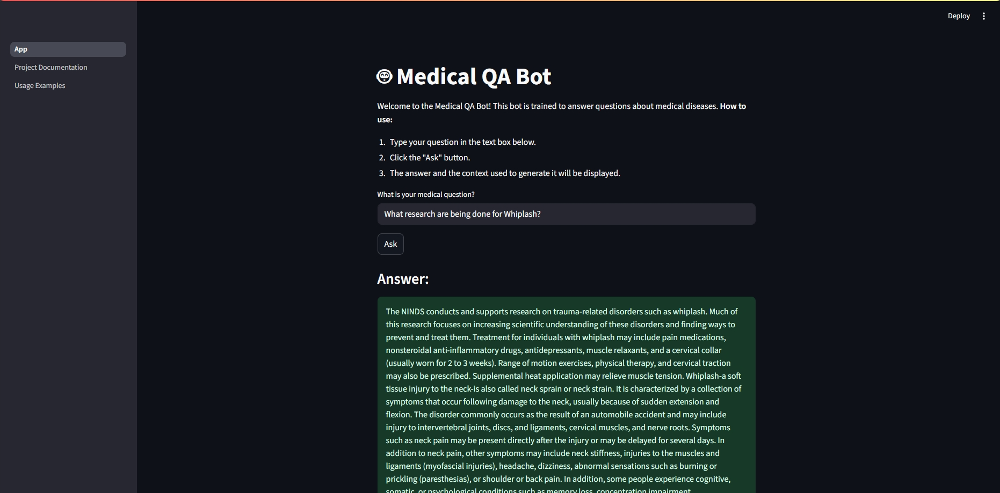
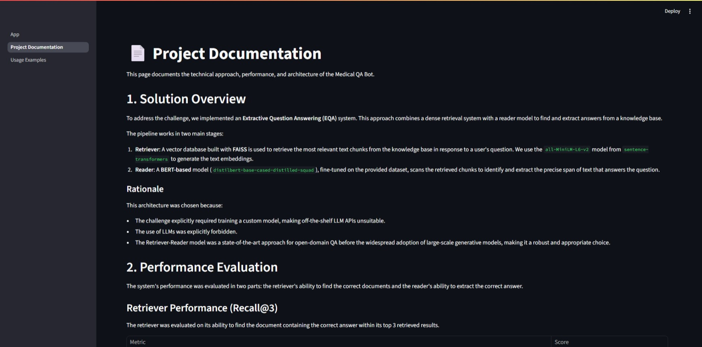
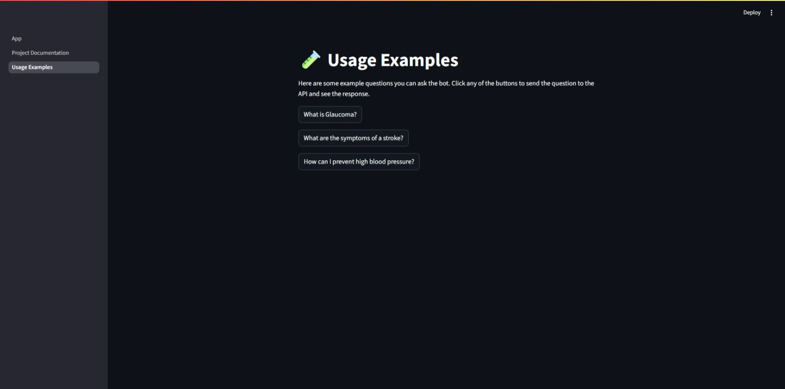

# Medical Assistant Bot

This project is a response to the Medical Assistant Bot Assignment. The objective is to develop a medical question-answering system using a provided dataset of medical information.

## Table of contents
- [Solution overview](#solution-overview)
- [Performance evaluation](#performance-evaluation)
- [Repository structure](#repository-structure)
- [Setup and installation](#setup-and-installation)
- [How to run](#how-to-run)
- [Limitations](#limitations)
- [Potential improvements](#potential-improvements)
- [Statement of independent work](#statement-of-independent-work)

## Solution overview

To address the challenge, we implemented an **Extractive Question Answering (EQA)** system. This approach combines a dense retrieval system with a reader model to find and extract answers from a knowledge base.

The pipeline works in two main stages:
1.  **Retriever**: A vector database built with **FAISS** is used to retrieve the most relevant text chunks from the knowledge base in response to a user's question. We use the `all-MiniLM-L6-v2` model from `sentence-transformers` to generate the text embeddings.
2.  **Reader**: A **BERT-based** model (`distilbert-base-cased-distilled-squad`), fine-tuned on the provided dataset, scans the retrieved chunks to identify and extract the precise span of text that answers the question.

### Rationale
This architecture was chosen for a few key reasons:
- The challenge explicitly required training a model, making off-the-shelf LLM APIs unsuitable.
- The use of LLMs was explicitly forbidden in the challenge description.
- The Retriever-Reader model was a state-of-the-art approach for open-domain QA before the widespread adoption of large-scale generative models, making it a robust and appropriate choice for this task.


### Screenshots

Below are example screenshots demonstrating the Medical Assistant Bot in action. All screenshots are located in the `screenshots/` directory.

#### 1. Example Question and Answer



#### 2. Project Documentation



#### 3. Usage Examples




## Performance Evaluation

The system's performance was evaluated in two parts: the retriever's ability to find the correct documents and the reader's ability to extract the correct answer from them.

### Retriever Performance
The retriever was evaluated on its ability to find the document containing the correct answer within its top 3 retrieved results (Recall@3).

| Metric | Score |
| :--- | :--- |
| **Recall@3** | **72.60%** |
| Total Questions | 500 |
| Hits (Correct Doc Found) | 363 |
| Misses (Correct Doc Not Found) | 137 |

This indicates that in about 73% of cases, the retriever successfully provides the correct context to the reader model.

### Question-Answering Performance
The end-to-end model was evaluated using Exact Match (EM) and F1-Score, which measures the overlap between the predicted and ground-truth answers.

| Method | Dataset | Exact Match | F1 Score |
| :--- | :--- | :--- | :--- |
| **Direct QA** (BERT only) | Test | 60.00% | **81.75%** |
| **Retrieval + QA** (Full Pipeline) | Test | 0.00% | **32.72%** |

**Analysis:**
- The fine-tuned BERT model performs well when given the correct context directly (81.75% F1).
- The performance drops significantly when combined with the retriever (32.72% F1). This suggests that while the retriever finds the correct document often, the context formed by combining multiple chunks may be too noisy, making it difficult for the reader to pinpoint the exact answer.
- The overfitting gap between training and test sets is small (5.24%), indicating the model generalizes well.

## Repository Structure
```
.
├── app
│   ├── App.py
│   └── pages
│       ├── Project_Documentation.py
│       └── Usage_Examples.py
├── data
│   ├── intern_screening_dataset.csv
│   └── run_6
│       ├── squad_test_data.json
│       ├── squad_train_data.json
│       └── squad_val_data.json
├── docs
│   ├── challenge_description.md
│   └── todo_list.md
├── models
│   └── run_6
│       ├── chunks_metadata.pkl
│       ├── faiss_index.bin
│       └── final_model
├── notebooks
│   ├── exploratory_data_analysis.ipynb
│   └── model_evaluation.ipynb
├── reports
│   └── run_6
├── results
│   └── run_6
├── src
│   ├── api.py
│   ├── config.py
│   ├── download_data.py
│   ├── evaluate.py
│   ├── evaluate_retriever.py
│   ├── logger.py
│   ├── main.py
│   ├── prepare_train_data.py
│   ├── prepare_vector_database.py
│   └── train.py
├── .dockerignore
├── .gitignore
├── .python-version
├── docker-compose.yml
├── Dockerfile
├── pyproject.toml
├── README.md
└── start_services.ps1
```

## Setup and Installation

### Prerequisites
- **Docker** and **Docker Compose**: Ensure you have Docker Desktop installed and running
  - [Install Docker Desktop for Windows](https://docs.docker.com/desktop/install/windows-install/)
  - [Install Docker Desktop for Mac](https://docs.docker.com/desktop/install/mac-install/)
  - [Install Docker Desktop for Linux](https://docs.docker.com/desktop/install/linux-install/)

### Installation Steps

1. **Clone the repository:**
   ```bash
   git clone git@github.com:aronifanger/factored-medical-qa-bot.git
   cd factored-medical-qa-bot
   ```

2. **Download the pre-trained model:**
   
   Download the model files from: [link to the trained model](https://drive.google.com/file/d/1MgE-A-SWJ7J4z73Jv55FUJTGxnAtzB1X/view?usp=sharing)
   
   Extract the downloaded file to the `models/` directory. After extraction, you should have the folder structure:
   ```
   models/
   └── run_6/
       ├── chunks_metadata.pkl
       ├── faiss_index.bin
       └── final_model/
   ```

   **Extraction commands:**

   **Linux/Mac:**
   ```bash
   # If downloaded as .zip
   unzip model_run_6.zip -d models/
   
   # If downloaded as .tar.gz
   tar -xzf model_run_6.tar.gz -C models/
   ```

   **Windows (PowerShell):**
   ```powershell
   # If downloaded as .zip
   Expand-Archive -Path "model_run_6.zip" -DestinationPath "models\"
   
   # If downloaded as .tar.gz (requires 7-Zip or similar)
   7z x model_run_6.tar.gz -o"models\"
   ```

3. **Build and run with Docker Compose:**
   ```bash
   docker-compose up --build
   ```

   This will:
   - Build the Docker images for both backend and frontend
   - Start the API service on port 8001
   - Start the Streamlit frontend on port 8501
   - Automatically link the services together

## How to Run

### Quick Start with Docker Compose

```bash
docker-compose up
```

This single command will:
- Start the backend API server at `http://localhost:8001`
- Start the frontend web application at `http://localhost:8501`
- Automatically open the Streamlit app in your browser

### Alternative: Manual Training and Setup

If you want to train the model from scratch or don't have the pre-trained model:

1. **Install Python dependencies locally:**
   ```bash
   # Create virtual environment
   python -m venv .venv
   source .venv/bin/activate # Linux/Mac
   # .\.venv\Scripts\activate # Windows
   
   # Install dependencies
   pip install uv
   uv pip install -e .
   ```

2. **Run the full training pipeline:**
   ```bash
   python src/main.py
   ```
   
   This will download data, train the model, and create all necessary files in `models/run_6/`.

3. **Start services with Docker Compose:**
   ```bash
   docker-compose up --build
   ```

### Stopping the Services

To stop all services:
```bash
docker-compose down
```

## Limitations

1.  **Dataset Formatting**: The provided dataset was not structured for Extractive Question Answering, as it lacks distinct `context` and `answer` fields where the answer is a direct span of the context. This introduced a bias where the model often extracts the entire text chunk instead of a more concise answer.
2.  **Time Constraints**: The project timeline was limited, which restricted the opportunity for extensive iteration, experimentation, and refinement of the models and code.

## Potential Improvements

-   **Model Performance**: The most significant improvement would come from correctly formatting the training data. By creating explicit `(question, context, answer_span)` triplets, the model could be trained to extract more precise answers instead of defaulting to the full retrieved context.
-   **Retriever Performance**: More time could be dedicated to experimenting with different embedding models and chunking strategies to improve the `Recall@k` score.
-   **Test-Driven Development (TDD)**: Given the time constraints, TDD was not adopted. For a long-term project, incorporating tests from the beginning would improve code quality, maintainability, and reliability.
-   **Cross-Platform Compatibility**: The project was developed on Windows. For broader compatibility and easier deployment, the environment should be containerized using Docker with a Linux base.
-   **Code Review and Refinement**: A thorough code review would help enforce consistent coding standards, improve function-level documentation, and potentially refactor modules for better clarity and efficiency.

## Statement of independent work

This project was developed with the explicit instruction to solve the problem independently. In adherence to the spirit of this requirement, the core intellectual and technical components of this solution were developed without direct AI intervention. However, in the interest of full transparency and to align with modern, efficient development practices, a third-party AI assistant was utilized as a productivity tool for specific ancillary tasks.

### Areas of adherence and acknowledged assistance

To maintain the integrity of the core solution, AI assistance was explicitly **avoided** in the following areas:

* **Core solution logic:** The final system is self-contained and does not rely on any external AI APIs to generate answers. The entire inference pipeline is a direct result of the implemented code.
* **Data integrity:** The training data was generated and processed exclusively by the provided scripts operating on the original dataset.
* **Model training:** The fine-tuning process was standard, utilizing the Hugging Face `Trainer` without any AI-assisted techniques like knowledge distillation.

A third-party AI assistant **was leveraged** as a collaborative tool to accelerate development in these areas:

* **Solution scaffolding and research:** To quickly explore architectural approaches and understand the nuances of the SQuAD format and fine-tuning.
* **Debugging and environment setup:** To efficiently resolve common environment challenges and library compatibility issues.
* **Code review and refinement:** To act as a "pair programmer" for identifying bugs and suggesting performance optimizations.

### Rationale for a pragmatic approach

This approach was chosen to deliver a complete, end-to-end system within the condensed timeframe of approximately 20 working hours. A partial delivery would have been a poor representation of the required skills:

* Focusing only on the **information retrieval** component would not have demonstrated the core AI and model training capabilities.
* Conversely, focusing only on **model fine-tuning** without AI assistance carried a high risk of delays due to common debugging issues and would not have shown system integration skills.

Furthermore, it is acknowledged that the most appropriate solution for this type of system would leverage modern LLMs due to their superior performance. The target role's requirements, which emphasize LLMs, suggest that engineering challenges in this domain are shifting from fine-tuning legacy models to robust integration and consumption (e.g., RAG).

Therefore, using AI as an aid enabled the delivery of a more comprehensive project that showcases the full development lifecycle, which felt more aligned with the ultimate goals of the assignment. The final implemented solution represents my own work, with AI serving as a tool to accelerate the process rather than to generate the core logic.

## Appendix: Example Prediction Results

### Correct Predictions (Direct QA)

**Example 1:**
- Question: what research (or clinical trials) is being done for Whiplash ?
- Gold Answer: The NINDS conducts and supports research on trauma-related disorders such as whiplash. Much of this research focuses on increasing scientific understanding of these disorders and finding ways to prevent and treat them.
- Predicted: The NINDS conducts and supports research on trauma-related disorders such as whiplash. Much of this research focuses on increasing scientific understanding of these disorders and finding ways to prevent and treat them.
- Confidence: 1.000
- Context: The first symptoms of rabies may be very similar to those of the flu including general weakness or discomfort, fever, or headache. These symptoms may last for days.
                
There may be also discomfort or a prickling or itching sensation at the site of bite, progressing within days to symptoms of cerebral dysfunction, anxiety, confusion, agitation. As the disease progresses, the person may experience delirium, abnormal behavior, hallucinations, and insomnia.
                
The acute period of disease typically ends after 2 to 10 days. Once clinical signs of rabies appear, the disease is nearly always fatal, and treatment is typically supportive.
                
Disease prevention includes administration of both passive antibody, through an injection of human immune globulin and a round of injections with rabies vaccine.
                
Once a person begins to exhibit signs of the disease, survival is rare. To date less than 10 documented cases of human survival from clinical rabies have been reported and only two have not had a history of pre- or postexposure prophylaxis.

---

The NINDS conducts and supports research on trauma-related disorders such as whiplash. Much of this research focuses on increasing scientific understanding of these disorders and finding ways to prevent and treat them.

---

How is HEM diagnosed? Establishing a diagnosis of HEM prenatally can be difficult and may require the interaction between a perinatologist, geneticist, and fetal/neonatal pathologist. Clinical examination, radiographs, genetic testing, and autopsy may be performed in order to establish a diagnosis of HEM.

**Example 2:**
- Question: How many people are affected by hereditary spherocytosis ?
- Gold Answer: Hereditary spherocytosis occurs in 1 in 2,000 individuals of Northern European ancestry. This condition is the most common cause of inherited anemia in that population. The prevalence of hereditary spherocytosis in people of other ethnic backgrounds is unknown, but it is much less common.
- Predicted: Hereditary spherocytosis occurs in 1 in 2,000 individuals of Northern European ancestry. This condition is the most common cause of inherited anemia in that population. The prevalence of hereditary spherocytosis in people of other ethnic backgrounds is unknown, but it is much less common.
- Confidence: 1.000
- Context: Prostate cancer is most common in older men. In the U.S., about one out of five men will be diagnosed with prostate cancer. Most men diagnosed with prostate cancer do not die of it.    See the following PDQ summaries for more information about prostate cancer:         -  Prostate Cancer Screening     -  Prostate Cancer Treatment

---

Hereditary spherocytosis occurs in 1 in 2,000 individuals of Northern European ancestry. This condition is the most common cause of inherited anemia in that population. The prevalence of hereditary spherocytosis in people of other ethnic backgrounds is unknown, but it is much less common.

---

What are the signs and symptoms of Lethal congenital contracture syndrome 2? The Human Phenotype Ontology provides the following list of signs and symptoms for Lethal congenital contracture syndrome 2. If the information is available, the table below includes how often the symptom is seen in people with this condition. You can use the MedlinePlus Medical Dictionary to look up the definitions for these medical terms. Signs and Symptoms Approximate number of patients (when available) Dilated cardiomyopathy 7.5% Ventricular septal defect 7.5% Akinesia - Autosomal recessive inheritance - Decreased fetal movement - Degenerative vitreoretinopathy - Edema - Hydronephrosis - Polyhydramnios - Respiratory failure - Severe Myopia - Skeletal muscle atrophy - The Human Phenotype Ontology (HPO) has collected information on how often a sign or symptom occurs in a condition. Much of this information comes from Orphanet, a European rare disease database. The frequency of a sign or symptom is usually listed as a rough estimate of the percentage of patients who have that feature. The frequency may also be listed as a fraction. The first number of the fraction is how many people had the symptom, and the second number is the total number of people who were examined in one study. For example, a frequency of 25/25 means that in a study of 25 people all patients were found to have that symptom. Because these frequencies are based on a specific study, the fractions may be different if another group of patients are examined. Sometimes, no information on frequency is available. In these cases, the sign or symptom may be rare or common.

### Incorrect Predictions (Direct QA)

**Example 1:**
- Question: What are the symptoms of Marfan syndrome ?
- Gold Answer: What are the signs and symptoms of Marfan syndrome? The signs and symptoms of Marfan syndrome vary widely in severity, timing of onset, and rate of progression. Affected individuals often are tall and lean, have elongated fingers and toes (arachnodactyly), and have an arm span that exceeds body height. Other common features include unusually flexible joints, a long and narrow face, a highly arched roof of the mouth and crowded teeth, an abnormal curvature of the spine (scoliosis), and either a sunken chest (pectus excavatum) or a protruding chest (pectus carinatum). About half of people with Marfan syndrome have a dislocated lens (ectopia lentis) in one or both eyes, and most have some degree of nearsightedness (myopia). Clouding of the lens (cataract) may occur in mid adulthood, and increased pressure within the eye (glaucoma) occurs more frequently than in people without Marfan syndrome. Most people with Marfan syndrome have abnormalities of the heart and the aorta. Leaks in valves that control blood flow through the heart can cause shortness of breath, fatigue, and an irregular heartbeat felt as skipped or extra beats (palpitations). If leakage occurs, it usually affects the mitral valve, which is a valve between two chambers of the heart, or the aortic valve that regulates blood flow from the heart into the aorta. The first few inches of the aorta can weaken and stretch, which may lead to a bulge in the blood vessel wall (an aneurysm). The increased size of the aorta may cause the aortic valve to leak, which can lead to a sudden tearing of the layers in the aorta wall (aortic dissection). Aortic aneurysm and dissection can be life threatening. The Human Phenotype Ontology provides the following list of signs and symptoms for Marfan syndrome. If the information is available, the table below includes how often the symptom is seen in people with this condition. You can use the MedlinePlus Medical Dictionary to look up the definitions for these medical terms. Signs and Symptoms Approximate number of patients (when available) Arachnodactyly 90% Dilatation of the ascending aorta 90% Disproportionate tall stature 90% Muscular hypotonia 90% Pes planus 90% Skeletal muscle atrophy 90% Striae distensae 90% Aneurysm 50% Arthralgia 50% Decreased body weight 50% Dental malocclusion 50% Dural ectasia 50% Hypoplasia of the zygomatic bone 50% Joint hypermobility 50% Myopia 50% Narrow face 50% Pectus excavatum 50% Protrusio acetabuli 50% Scoliosis 50% Sleep disturbance 50% Visual impairment 50% Abnormality of the aortic valve 7.5% Abnormality of the endocardium 7.5% Aortic dissection 7.5% Arterial dissection 7.5% Attention deficit hyperactivity disorder 7.5% Chest pain 7.5% Cleft palate 7.5% Congestive heart failure 7.5% Dolichocephaly 7.5% Ectopia lentis 7.5% Flat cornea 7.5% Glaucoma 7.5% Hernia of the abdominal wall 7.5% Kyphosis 7.5% Limitation of joint mobility 7.5% Meningocele 7.5% Myalgia 7.5% Reduced bone mineral density 7.5% Retinal detachment 7.5% Emphysema 5% Esotropia 5% Exotropia 5% Aortic regurgitation - Aortic root dilatation - Ascending aortic aneurysm - Autosomal dominant inheritance - Cataract - Decreased muscle mass - Decreased subcutaneous fat - Deeply set eye - Dental crowding - Flexion contracture - Genu recurvatum - Hammertoe - High palate - Hypoplasia of the iris - Incisional hernia - Increased axial globe length - Kyphoscoliosis - Long face - Malar flattening - Medial rotation of the medial malleolus - Mitral regurgitation - Mitral valve prolapse - Narrow palate - Overgrowth - Pectus carinatum - Pes cavus - Pneumothorax - Premature calcification of mitral annulus - Premature osteoarthritis - Pulmonary artery dilatation - Retrognathia - Spondylolisthesis - Tall stature - Tricuspid valve prolapse - The Human Phenotype Ontology (HPO) has collected information on how often a sign or symptom occurs in a condition. Much of this information comes from Orphanet, a European rare disease database. The frequency of a sign or symptom is usually listed as a rough estimate of the percentage of patients who have that feature. The frequency may also be listed as a fraction. The first number of the fraction is how many people had the symptom, and the second number is the total number of people who were examined in one study. For example, a frequency of 25/25 means that in a study of 25 people all patients were found to have that symptom. Because these frequencies are based on a specific study, the fractions may be different if another group of patients are examined. Sometimes, no information on frequency is available. In these cases, the sign or symptom may be rare or common.
- Predicted: What
- Confidence: 0.002
- F1 Score: 0.00
- Context: What are the signs and symptoms of Marfan syndrome? The signs and symptoms of Marfan syndrome vary widely in severity, timing of onset, and rate of progression. Affected individuals often are tall and lean, have elongated fingers and toes (arachnodactyly), and have an arm span that exceeds body height. Other common features include unusually flexible joints, a long and narrow face, a highly arched roof of the mouth and crowded teeth, an abnormal curvature of the spine (scoliosis), and either a sunken chest (pectus excavatum) or a protruding chest (pectus carinatum). About half of people with Marfan syndrome have a dislocated lens (ectopia lentis) in one or both eyes, and most have some degree of nearsightedness (myopia). Clouding of the lens (cataract) may occur in mid adulthood, and increased pressure within the eye (glaucoma) occurs more frequently than in people without Marfan syndrome. Most people with Marfan syndrome have abnormalities of the heart and the aorta. Leaks in valves that control blood flow through the heart can cause shortness of breath, fatigue, and an irregular heartbeat felt as skipped or extra beats (palpitations). If leakage occurs, it usually affects the mitral valve, which is a valve between two chambers of the heart, or the aortic valve that regulates blood flow from the heart into the aorta. The first few inches of the aorta can weaken and stretch, which may lead to a bulge in the blood vessel wall (an aneurysm). The increased size of the aorta may cause the aortic valve to leak, which can lead to a sudden tearing of the layers in the aorta wall (aortic dissection). Aortic aneurysm and dissection can be life threatening. The Human Phenotype Ontology provides the following list of signs and symptoms for Marfan syndrome. If the information is available, the table below includes how often the symptom is seen in people with this condition. You can use the MedlinePlus Medical Dictionary to look up the definitions for these medical terms. Signs and Symptoms Approximate number of patients (when available) Arachnodactyly 90% Dilatation of the ascending aorta 90% Disproportionate tall stature 90% Muscular hypotonia 90% Pes planus 90% Skeletal muscle atrophy 90% Striae distensae 90% Aneurysm 50% Arthralgia 50% Decreased body weight 50% Dental malocclusion 50% Dural ectasia 50% Hypoplasia of the zygomatic bone 50% Joint hypermobility 50% Myopia 50% Narrow face 50% Pectus excavatum 50% Protrusio acetabuli 50% Scoliosis 50% Sleep disturbance 50% Visual impairment 50% Abnormality of the aortic valve 7.5% Abnormality of the endocardium 7.5% Aortic dissection 7.5% Arterial dissection 7.5% Attention deficit hyperactivity disorder 7.5% Chest pain 7.5% Cleft palate 7.5% Congestive heart failure 7.5% Dolichocephaly 7.5% Ectopia lentis 7.5% Flat cornea 7.5% Glaucoma 7.5% Hernia of the abdominal wall 7.5% Kyphosis 7.5% Limitation of joint mobility 7.5% Meningocele 7.5% Myalgia 7.5% Reduced bone mineral density 7.5% Retinal detachment 7.5% Emphysema 5% Esotropia 5% Exotropia 5% Aortic regurgitation - Aortic root dilatation - Ascending aortic aneurysm - Autosomal dominant inheritance - Cataract - Decreased muscle mass - Decreased subcutaneous fat - Deeply set eye - Dental crowding - Flexion contracture - Genu recurvatum - Hammertoe - High palate - Hypoplasia of the iris - Incisional hernia - Increased axial globe length - Kyphoscoliosis - Long face - Malar flattening - Medial rotation of the medial malleolus - Mitral regurgitation - Mitral valve prolapse - Narrow palate - Overgrowth - Pectus carinatum - Pes cavus - Pneumothorax - Premature calcification of mitral annulus - Premature osteoarthritis - Pulmonary artery dilatation - Retrognathia - Spondylolisthesis - Tall stature - Tricuspid valve prolapse - The Human Phenotype Ontology (HPO) has collected information on how often a sign or symptom occurs in a condition. Much of this information comes from Orphanet, a European rare disease database. The frequency of a sign or symptom is usually listed as a rough estimate of the percentage of patients who have that feature. The frequency may also be listed as a fraction. The first number of the fraction is how many people had the symptom, and the second number is the total number of people who were examined in one study. For example, a frequency of 25/25 means that in a study of 25 people all patients were found to have that symptom. Because these frequencies are based on a specific study, the fractions may be different if another group of patients are examined. Sometimes, no information on frequency is available. In these cases, the sign or symptom may be rare or common.

---

The prevalence of isolated polymicrogyria is unknown. Researchers believe that it may be relatively common overall, although the individual forms of the disorder (such as bilateral generalized polymicrogyria) are probably rare.

---

These resources address the diagnosis or management of hyperferritinemia-cataract syndrome:  - Boston Children's Hospital: Cataracts in Children  - Genetic Testing Registry: Hyperferritinemia cataract syndrome  - MedlinePlus Encyclopedia: Cataract Removal   These resources from MedlinePlus offer information about the diagnosis and management of various health conditions:  - Diagnostic Tests  - Drug Therapy  - Surgery and Rehabilitation  - Genetic Counseling   - Palliative Care

**Example 2:**
- Question: What to do for What I need to know about Gestational Diabetes ?
- Gold Answer: Your health care team will help you make a healthy eating plan with food choices that are good for both you and your baby. These choices are good for you to follow throughout pregnancy and after, as you raise your family.
                
Using a healthy eating plan will help your blood glucose stay in your target range. The plan will help you know which foods to eat, how much to eat, and when to eat. Food choices, amounts, and timing are all important in keeping your blood glucose levels in your target range.
                
More information is provided in the NIDDK health topic, What I need to know about Eating and Diabetes.
                

                
Physical Activity
                
Physical activity can help you reach your blood glucose targets. Talk with your doctor about the type of activity that is best for you. If you are already active, tell your doctor what you do. Being physically active will also help lower your chances of having type 2 diabetesand its problemsin the future. Now is the time to develop good habits for you and your baby.
                
For more information about physical activity and pregnancy, visit www.womenshealth.gov/pregnancy.
                
Insulin Shots
                
If you have trouble meeting your blood glucose targets, you may need to take a medicine called insulin, along with following a healthy meal plan and being physically active. Your health care team will show you how to give yourself insulin shots. Insulin will not harm your baby.
- Predicted: Your health care team will help you make a healthy eating plan with food choices that are good for both you and your baby. These choices are good for you to follow throughout pregnancy and after, as you raise your family.
                
Using a healthy eating plan will help your blood glucose stay in your target range. The plan will help you know which foods to eat, how much to eat, and when to eat. Food choices, amounts, and timing are all important in keeping your blood glucose levels in your target range.
                
More information is provided in the NIDDK health topic, What I need to know about Eating and Diabetes.
                

                
Physical Activity
                
Physical activity can help you reach your blood glucose targets. Talk with your doctor about the type of activity that is best for you. If you are already active, tell your doctor
- Confidence: 0.967
- F1 Score: 0.76
- Context: Familial thoracic aortic aneurysm and dissection (familial TAAD) involves problems with the aorta, which is the large blood vessel that distributes blood from the heart to the rest of the body. Familial TAAD affects the upper part of the aorta, near the heart. This part of the aorta is called the thoracic aorta because it is located in the chest (thorax). Other vessels that carry blood from the heart to the rest of the body (arteries) can also be affected.  In familial TAAD, the aorta can become weakened and stretched (aortic dilatation), which can lead to a bulge in the blood vessel wall (an aneurysm). Aortic dilatation may also lead to a sudden tearing of the layers in the aorta wall (aortic dissection), allowing blood to flow abnormally between the layers. These aortic abnormalities are potentially life-threatening because they can decrease blood flow to other parts of the body such as the brain or other vital organs, or cause the aorta to break open (rupture).  The occurrence and timing of these aortic abnormalities vary, even within the same affected family. They can begin in childhood or not occur until late in life. Aortic dilatation is generally the first feature of familial TAAD to develop, although in some affected individuals dissection occurs with little or no aortic dilatation.  Aortic aneurysms usually have no symptoms. However, depending on the size, growth rate, and location of these abnormalities, they can cause pain in the jaw, neck, chest, or back; swelling in the arms, neck, or head; difficult or painful swallowing; hoarseness; shortness of breath; wheezing; a chronic cough; or coughing up blood. Aortic dissections usually cause severe, sudden chest or back pain, and may also result in unusually pale skin (pallor), a very faint pulse, numbness or tingling (paresthesias) in one or more limbs, or paralysis.  Familial TAAD may not be associated with other signs and symptoms. However, some individuals in affected families show mild features of related conditions called Marfan syndrome or Loeys-Dietz syndrome. These features include tall stature, stretch marks on the skin, an unusually large range of joint movement (joint hypermobility), and either a sunken or protruding chest. Occasionally, people with familial TAAD develop aneurysms in the brain or in the section of the aorta located in the abdomen (abdominal aorta). Some people with familial TAAD have heart abnormalities that are present from birth (congenital). Affected individuals may also have a soft out-pouching in the lower abdomen (inguinal hernia), an abnormal curvature of the spine (scoliosis), or a purplish skin discoloration (livedo reticularis) caused by abnormalities in the tiny blood vessels of the skin (dermal capillaries). However, these conditions are also common in the general population. Depending on the genetic cause of familial TAAD in particular families, they may have an increased risk of developing blockages in smaller arteries, which can lead to heart attack and stroke.

---

Mutations in the RPS6KA3 gene cause Coffin-Lowry syndrome. This gene provides instructions for making a protein that is involved in signaling within cells. Researchers believe that this protein helps control the activity of other genes and plays an important role in the brain. The protein is involved in cell signaling pathways that are required for learning, the formation of long-term memories, and the survival of nerve cells. Gene mutations result in the production of little or no RPS6KA3 protein, but it is unclear how a lack of this protein causes the signs and symptoms of Coffin-Lowry syndrome.  Some people with the features of Coffin-Lowry syndrome do not have identified mutations in the RPS6KA3 gene. In these cases, the cause of the condition is unknown.

---

Your health care team will help you make a healthy eating plan with food choices that are good for both you and your baby. These choices are good for you to follow throughout pregnancy and after, as you raise your family.
                
Using a healthy eating plan will help your blood glucose stay in your target range. The plan will help you know which foods to eat, how much to eat, and when to eat. Food choices, amounts, and timing are all important in keeping your blood glucose levels in your target range.
                
More information is provided in the NIDDK health topic, What I need to know about Eating and Diabetes.
                

                
Physical Activity
                
Physical activity can help you reach your blood glucose targets. Talk with your doctor about the type of activity that is best for you. If you are already active, tell your doctor what you do. Being physically active will also help lower your chances of having type 2 diabetesand its problemsin the future. Now is the time to develop good habits for you and your baby.
                
For more information about physical activity and pregnancy, visit www.womenshealth.gov/pregnancy.
                
Insulin Shots
                
If you have trouble meeting your blood glucose targets, you may need to take a medicine called insulin, along with following a healthy meal plan and being physically active. Your health care team will show you how to give yourself insulin shots. Insulin will not harm your baby.

### Retrieval+QA Failures

**Example 1:**
- Question: What are the symptoms of Marfan syndrome ?
- Gold Answer: What are the signs and symptoms of Marfan syndrome? The signs and symptoms of Marfan syndrome vary widely in severity, timing of onset, and rate of progression. Affected individuals often are tall and lean, have elongated fingers and toes (arachnodactyly), and have an arm span that exceeds body height. Other common features include unusually flexible joints, a long and narrow face, a highly arched roof of the mouth and crowded teeth, an abnormal curvature of the spine (scoliosis), and either a sunken chest (pectus excavatum) or a protruding chest (pectus carinatum). About half of people with Marfan syndrome have a dislocated lens (ectopia lentis) in one or both eyes, and most have some degree of nearsightedness (myopia). Clouding of the lens (cataract) may occur in mid adulthood, and increased pressure within the eye (glaucoma) occurs more frequently than in people without Marfan syndrome. Most people with Marfan syndrome have abnormalities of the heart and the aorta. Leaks in valves that control blood flow through the heart can cause shortness of breath, fatigue, and an irregular heartbeat felt as skipped or extra beats (palpitations). If leakage occurs, it usually affects the mitral valve, which is a valve between two chambers of the heart, or the aortic valve that regulates blood flow from the heart into the aorta. The first few inches of the aorta can weaken and stretch, which may lead to a bulge in the blood vessel wall (an aneurysm). The increased size of the aorta may cause the aortic valve to leak, which can lead to a sudden tearing of the layers in the aorta wall (aortic dissection). Aortic aneurysm and dissection can be life threatening. The Human Phenotype Ontology provides the following list of signs and symptoms for Marfan syndrome. If the information is available, the table below includes how often the symptom is seen in people with this condition. You can use the MedlinePlus Medical Dictionary to look up the definitions for these medical terms. Signs and Symptoms Approximate number of patients (when available) Arachnodactyly 90% Dilatation of the ascending aorta 90% Disproportionate tall stature 90% Muscular hypotonia 90% Pes planus 90% Skeletal muscle atrophy 90% Striae distensae 90% Aneurysm 50% Arthralgia 50% Decreased body weight 50% Dental malocclusion 50% Dural ectasia 50% Hypoplasia of the zygomatic bone 50% Joint hypermobility 50% Myopia 50% Narrow face 50% Pectus excavatum 50% Protrusio acetabuli 50% Scoliosis 50% Sleep disturbance 50% Visual impairment 50% Abnormality of the aortic valve 7.5% Abnormality of the endocardium 7.5% Aortic dissection 7.5% Arterial dissection 7.5% Attention deficit hyperactivity disorder 7.5% Chest pain 7.5% Cleft palate 7.5% Congestive heart failure 7.5% Dolichocephaly 7.5% Ectopia lentis 7.5% Flat cornea 7.5% Glaucoma 7.5% Hernia of the abdominal wall 7.5% Kyphosis 7.5% Limitation of joint mobility 7.5% Meningocele 7.5% Myalgia 7.5% Reduced bone mineral density 7.5% Retinal detachment 7.5% Emphysema 5% Esotropia 5% Exotropia 5% Aortic regurgitation - Aortic root dilatation - Ascending aortic aneurysm - Autosomal dominant inheritance - Cataract - Decreased muscle mass - Decreased subcutaneous fat - Deeply set eye - Dental crowding - Flexion contracture - Genu recurvatum - Hammertoe - High palate - Hypoplasia of the iris - Incisional hernia - Increased axial globe length - Kyphoscoliosis - Long face - Malar flattening - Medial rotation of the medial malleolus - Mitral regurgitation - Mitral valve prolapse - Narrow palate - Overgrowth - Pectus carinatum - Pes cavus - Pneumothorax - Premature calcification of mitral annulus - Premature osteoarthritis - Pulmonary artery dilatation - Retrognathia - Spondylolisthesis - Tall stature - Tricuspid valve prolapse - The Human Phenotype Ontology (HPO) has collected information on how often a sign or symptom occurs in a condition. Much of this information comes from Orphanet, a European rare disease database. The frequency of a sign or symptom is usually listed as a rough estimate of the percentage of patients who have that feature. The frequency may also be listed as a fraction. The first number of the fraction is how many people had the symptom, and the second number is the total number of people who were examined in one study. For example, a frequency of 25/25 means that in a study of 25 people all patients were found to have that symptom. Because these frequencies are based on a specific study, the fractions may be different if another group of patients are examined. Sometimes, no information on frequency is available. In these cases, the sign or symptom may be rare or common.
- Predicted: What
- Retrieved Context: What are the signs and symptoms of Marfan syndrome? The signs and symptoms of Marfan syndrome vary widely in severity, timing of onset, and rate of progression. Affected individuals often are tall and lean, have elongated fingers and toes (arachnodactyly), and have an arm span that exceeds body height. Other common features include unusually flexible joints, a long and narrow face, a highly arched roof of the mouth and crowded teeth, an abnormal curvature of the spine (scoliosis), and either a sunken chest (pectus excavatum) or a protruding chest (pectus carinatum). About half of people with Marfan syndrome have a dislocated lens (ectopia lentis) in one or both eyes, and most have some degree of nearsightedness (myopia). Clouding of the lens (cataract) may occur in mid adulthood, and increased pressure within the eye (glaucoma) occurs more frequently than in people without Marfan syndrome. Most people with Marfan syndrome have abnormalities of the heart and the aorta. Leaks in valves that control blood flow through the heart can cause shortness of breath, fatigue, and an irregular heartbeat felt as skipped or extra beats (palpitations). If leakage occurs, it usually affects the mitral valve, which is a valve between two chambers of the heart, or the aortic valve that regulates blood flow from the heart into the aorta. The first few inches of the aorta can weaken and stretch, which may lead to a bulge in the blood vessel wall (an aneurysm). The increased size of the aorta may cause the aortic valve to leak, which can lead to a sudden tearing of the layers in the aorta wall (aortic dissection). Aortic aneurysm and dissection can be life threatening. Aortic aneurysm 